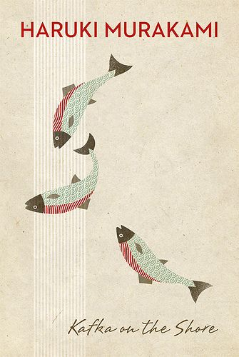

Unexpectedly, 2019 was a year where I dove into the genre of magical realism. I didn’t intend for this (I went into all of these books essentially blind), but among the books I read last year were Haruki Murakami’s _Norwegian Wood_, Gabriel García Márquez’ _One Hundred Years of Solitude_, and finally Murakami’s _Kafka on the Shore_. All of these texts are examples of magical realism, a style of fiction that adds magical elements to an otherwise realistic view of the world and paints it as mundane. I found the genre gives authors room to explore complex topics and the potential for the setting of an incredibly compelling story.

Japanese author Haruki Murakami’s work tackles the often taboo themes of loneliness, mental illness, and sexuality. I found myself entranced by his writing style-- the way he blended the surreal seamlessly into the real, the way I was left genuinely disturbed at certain scenes, the sharp sense of humor and illustrative similes, and the memorable characters. This was the case in _Norwegian Wood_ but I found the magical realism tuned up, as well as the emphasis on these themes in _Kafka on the Shore_.

The novel follows two parallel timelines, alternating chapters between two perspectives: one follows 15 year old Kafka Tamura who runs away from home in escape of a terrifying prophecy. The other follows a fifty-year-old man named Nakata, who suffered an accident as a child, rendering him slow and illiterate but able to talk to cats.

The novel plays with questions of fate and connectedness, and presents the existence of an alternate world, where people are neither alive nor dead. Several characters throughout the story have been to this world and leave a part of themselves there. In many ways this world can be viewed as the subconscious realm, where time stands still and dreams are experienced. There is a connectedness between characters explored here too. The chapters alternate between the seemingly unrelated plots of Kafka Tamura’s escape and Nakata’s story. Eventually, these stories become intertwined, and this connection between characters across this alternate world become apparent.

Sex is a prominent motif throughout the novel. Murakami’s descriptions of sex are explicit, though not erotically so. They come across as purposeful and intentionally disturbing (recall the protagonist is only 15). Murakami does not restrain characters from telling us their thoughts or describing acts. I am not fond of overt sex in novels, though one might argue that here it is necessary, and this is my only real gripe with this book.

The beauty of this novel is as follows: It is trivial to wake up and scribble down everything you remember from your dreams. Murakami’s special talent is in that he made me feel like I was dreaming. I recommend this book to everyone just so that they might experience this, a demonstration of literary skill like none I’ve read before.

Before reading, I recommend reading a few of Franz Kafka’s short stories, namely [“The Metamorphosis”](https://www.kafka-online.info/the-metamorphosis.html) and [“In the Penal Colony.”](https://www.kafka-online.info/in-the-penal-colony.html) Murakami’s writing, especially in this novel, is laced with Kafkaesque elements, and these stories provide a good foundation for recognizing these motifs.

_Kafka on the Shore_ stood out for me from anything I’ve ever read for a multitude of reasons. Foremost, it was mind-bending to a degree that I had never considered possible from a book. At times reading this novel felt like what I imagine an acid trip feels like. There are many, many parts of this book I have not been able to find the meaning of, and many more which I’m sure I will never discern (though the novel does explain that this is totally acceptable). I finished this book in early October and it never really left my thoughts. I’m still thinking about this book. No other work has made me feel quite this way. I’m not sure I can immediately call it my favorite book, but it’s incredibly compelling, albeit dizzying and bizarre.

To conclude, I feel that, though this novel is certainly worth your time, it is not trivial to understand. The book is absolutely a page-turner, with a driving plot that obviates the novel’s success both in Japan and in western markets. If you're looking for a work of literature that will leave you endlessly thinking, perhaps even expanding what you consider your realm of conscience, then give this novel a shot.
